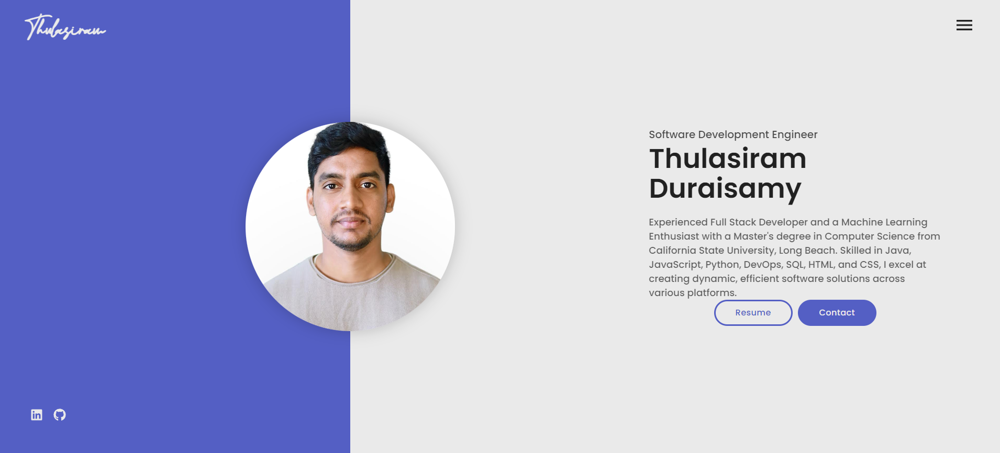
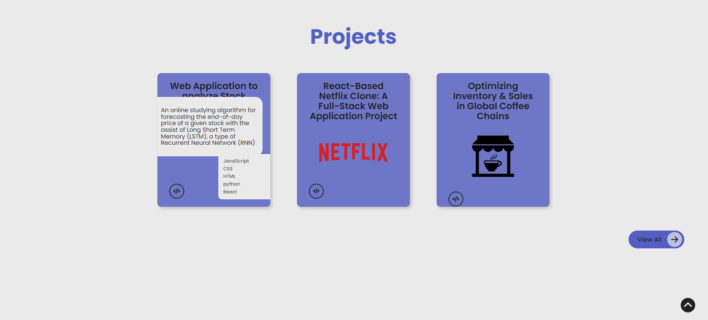

Showcasing the expertise of Thulasiram Duraisamy, a multifaceted software engineer with a rich background in full-stack development, DevOps, and AI-driven projects. With experience ranging from enhancing banking transaction systems at Accenture Solutions to pioneering advanced inventory optimization for global coffee chains, this portfolio illuminates a journey of impactful technological solutions. Specializing in languages like Java, JavaScript, and Python, and leveraging frameworks such as React and Spring Boot, Thulasiram has contributed to significant advancements in processing speeds, database optimization, and predictive modeling. The portfolio not only highlights professional achievements but also personal projects like a Web Application for stock market analysis using machine learning and a React-based Netflix clone, showcasing a profound ability to translate complex requirements into user-friendly solutions.

Intro Page:

Projects Page:

